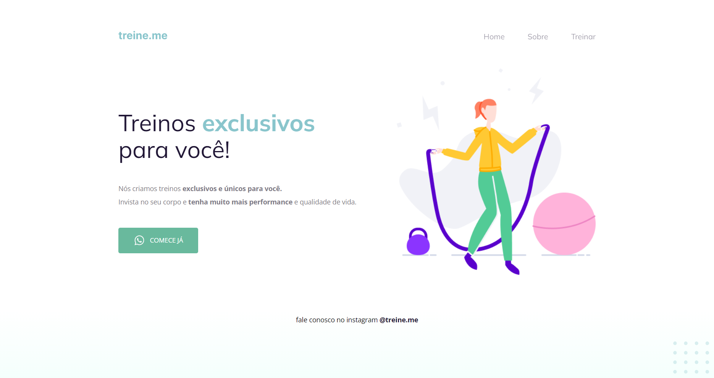

# Desafio 2: Aula 02 | Rocketseat Explorer 🚀

Segundo desafio da Aula 2 do curso [Explorer](https://app.rocketseat.com.br/explorer) da Rocketseat.
O explorer é um curso full-stack que ensina a programar desde o nível mais básico.
Neste desafio, a proposta era corrigir bugs em HTML e CSS.

🔗 [Clique aqui para ver o site ao vivo](https://mariak-fla.github.io/desafio2-RS/)

## ⚙️ Tecnologias

- HTML
- CSS
- Git
- Github